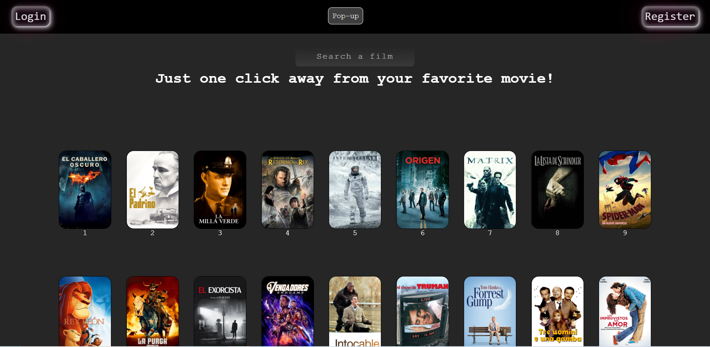
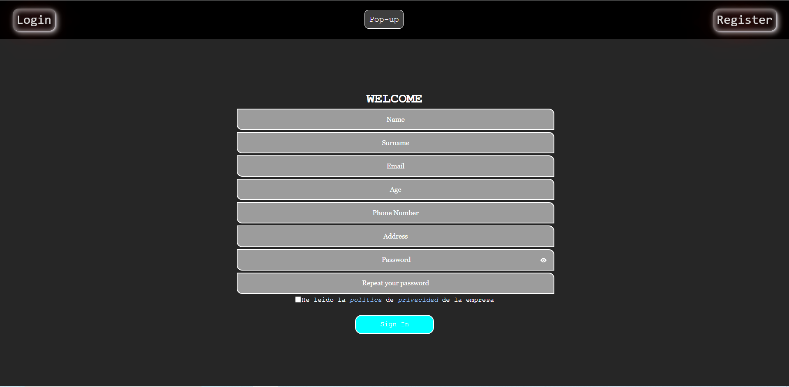
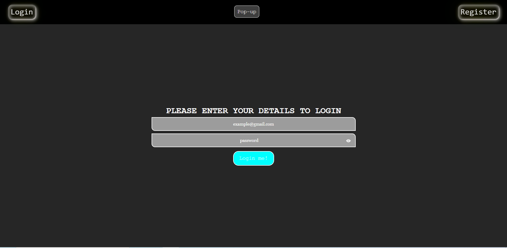
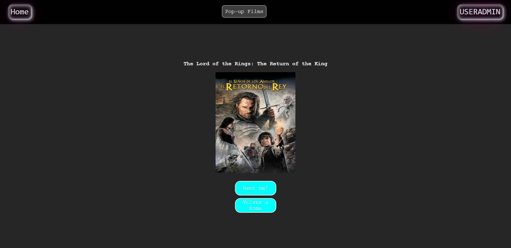
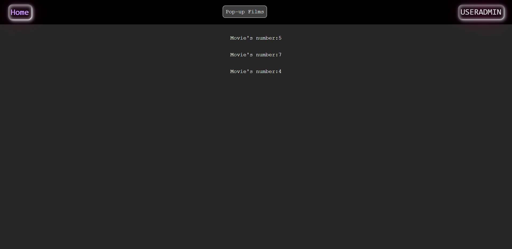
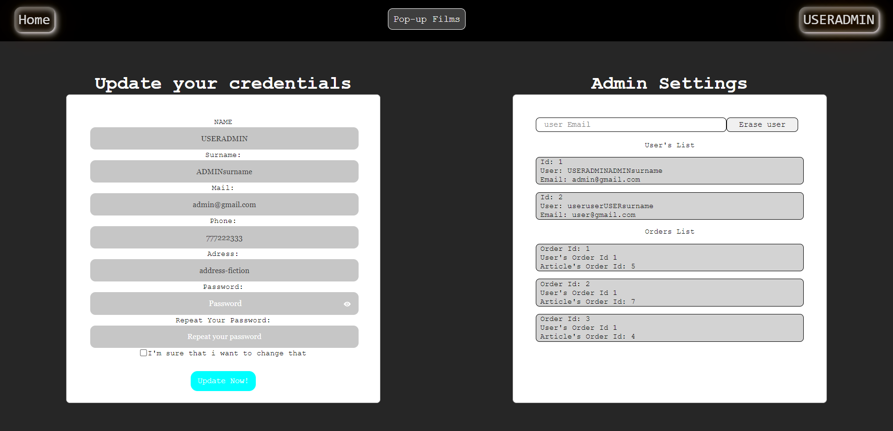
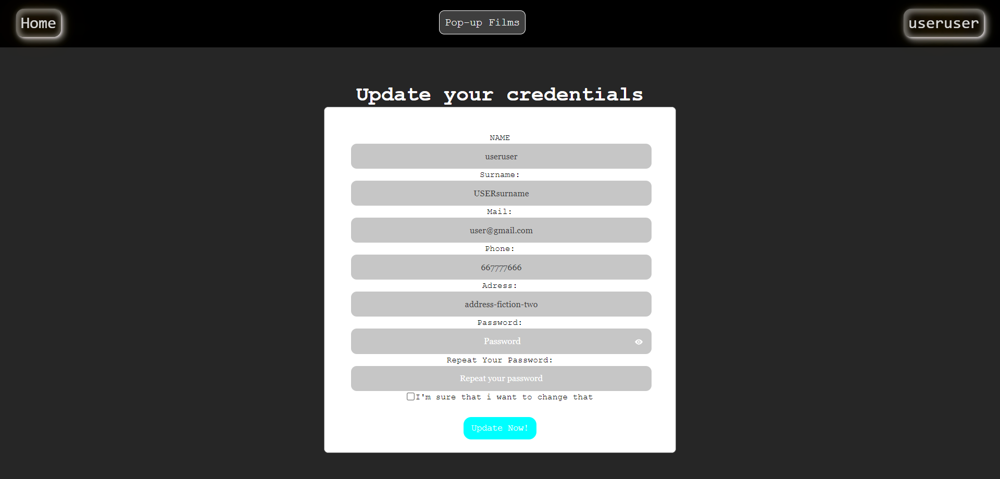

# Pop-up Films

## General Information

In this project we've made an API'S React FrontEnd, which is themes a movie rental.

## Appendix

Some of the funcionalities are:

- Bringing all movies
- Bringing rented movies
- Bring a movie on searchbar by title.
- Sign In as a user
- Log In
- Update your user
- Bring all registered users (as an admin)
- Delete selected user (as an admin)
- Bring all orders (as an admin)

## Table of content

- [Pop-up Films](#pop-up-films)
- [General Information](#general-information)
- [Appendix](#appendix)
- [Repositories](#repositories)
- [Environment Install](#environment-install)
- [Views](#views)
- [Technologies](#technologies-dependencies-and-libraries)
- [Authors](#authors)
- [Badges](#badges)

---

## Repositories

[Front End](https://github.com/Coquixo/React-Group-Project#authors)
[Back End](https://github.com/Coquixo/project04-backendmovies)

---

## Environment Install

#####Back End Steps:

- In order to start the project in our device we have to copy this link: "https://github.com/Coquixo/project04-backendmovies.git"
- Open our IDE console, insert "git clone" then paste the link and enter.
- Don't forget to work in the correct directory
- Install dependencies in terminal with command: 'npm i'
- Change file .env/config.js in order to set your enviorment variables into the container. API's port must be on 3001 on index.js lane 8.
- Execute 'npm run dev' on terminal.

#####Front End Steps:

- In order to start the project in our device we have to copy this link: "https://github.com/Coquixo/React-Group-Project.git"
- Open our IDE console, insert "git clone" then paste the link and enter.
- Don't forget to work in the correct directory
- Install dependencies in terminal with command: 'npm i'
- Execute 'npm start' in your terminal.

We want to upload it to production on next versions.

---

## Views

Main view, as 'Home'.
 

 

Sign In view.
 

 

Log In view.
 

 

Renting a selected movie view.

 

 

Rented movies view.

 

 

Settings view ( as an admin ).

 

 

Settings view ( as a user).

 

 

---

## Technologies, dependencies and libraries

Front End:

- [HTML5](https://html5.org/)
- [SCSS](https://sass-lang.com/)
- [CSS3](https://developer.mozilla.org/en-US/docs/Web/CSS)
- [JavaScript](https://www.javascript.com/)
- [ReactJS](https://es.reactjs.org/)
- [Redux](https://redux.js.org//)

Back End:

- [JavaScript](https://www.javascript.com/)
- [Node](https://nodejs.org/en/)
- [Express](https://expressjs.com/)
- [Sequelize](https://sequelize.org/)
- [Jwt-decode](https://jwt.io/)
- [Axios](https://axios-http.com//)
- [MySQL](https://www.mysql.com/)

---

## Authors

Alex Marcelo López Quiroga

- [Linked In](https://www.linkedin.com/in/alex-marcelo-l%C3%B3pez-quiroga-05a7b2194/)
- [Github](https://github.com/Coquixo)

Javier Moya Simó

- [Linked In](https://www.linkedin.com/in/javier-moya-simo/)
- [Github](https://github.com/JavierMoyaSimo)

---

## Badges

---

[BackToTop](#appendix)
